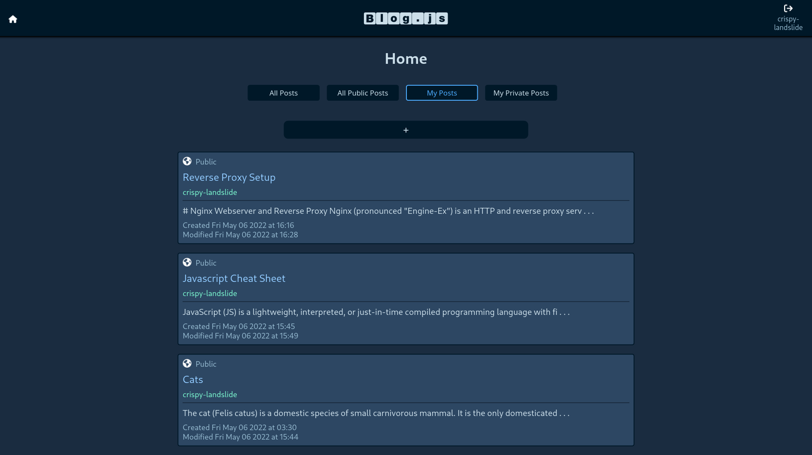

# Blog.js

Blog.js is a simple blogging platform allowing users to share ideas.



## Features
- Account creation and login via [Keycloak](https://www.keycloak.org/)
- Create public posts that everyone can read
- Create private posts that only you can read
- Edit your posts
- Markdown support - add images, code blocks, etc.
- View all posts by a specific user by clicking on their username

## Technologies
- Frontend: [React](https://reactjs.org/)
  - [react-router-dom](https://github.com/remix-run/react-router)
  - [react-keycloak](https://github.com/react-keycloak/react-keycloak/blob/master/packages/web/README.md)
  - [react-markdown](https://github.com/remarkjs/react-markdown#readme)
  - [remark-gfm](https://github.com/remarkjs/remark-gfm)
  - [react-syntax-highlighter](https://github.com/react-syntax-highlighter/react-syntax-highlighter)
- Backend: [Express](https://expressjs.com/)
  - [knex](https://knexjs.org/)
  - [express-session](https://github.com/expressjs/session)
  - [keycloak-connect](https://github.com/keycloak/keycloak-nodejs-connect)
  - [pg](https://github.com/brianc/node-postgres)
- Authentication: [Keycloak](https://www.keycloak.org/)
- Database: [PostgreSQL](https://www.postgresql.org/)

## Self-Hosting
If you would like to setup your own instance of Blog.js, start by ensuring you have [Keycloak](https://www.keycloak.org/) up and running. You will need to create two clients, one for the frontend and one for the backend. For example, you can call then `blogjs-app` and `blogjs-api`. Add the correct `Root URL` for both the frontend and backend. You should be able to keep the defaults for the frontend client, but for the backend client, under `Settings`, change the value for `Access Type` to `bearer-only`.

Once you have Keycloak set up, you can clone this repository and then copy the `docker-compose.yml.sample` file to `docker-compose.yml`. Then edit the environment variables to match your setup.  Inside of the `api` folder, you will have to create a folder called `env`, and inside this folder, make a file called `.env`, and another file called `db_pass.txt`. Inside the `.env` file, add the following environment variables:

```
REALM_PUBLIC_KEY=<PUBLIC KEY FROM KEYCLOAK REALM ADMIN PAGE>
KEYCLOAK_SECRET=<ANY RANDOMLY GENERATED SECRET>
```

Inside the `db_pass.txt` add a secure, randomly generated password for the database.

Once the environment variables are all setup, run `docker compose up -d` to start the containers.  If you make changes to the source code, you can rebuild the images with the `rebuild.sh` script.
